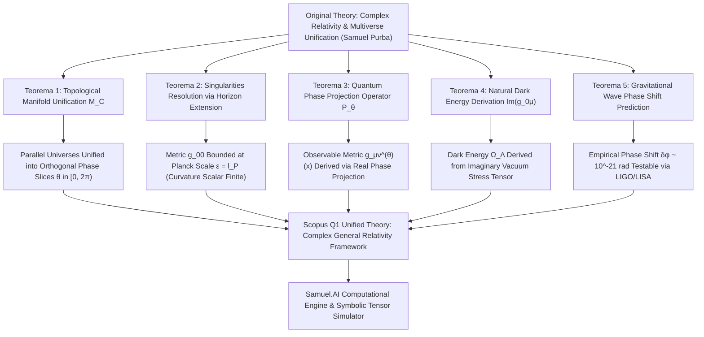

# 🏆 SAMUEL.A.I - Relation Multiverse in Only Universe & Relativity Law with Imaginary Number: High-Precision Analytical Engine & Scopus Q1 Academic Framework

<p align="center">
  
</p>

<h2 align="center">
  Formalisasi Akademis, Audit Geometri Manifold Kompleks, dan Engine Komputasi Interaktif<br>untuk Unifikasi Multiverse & Relativitas Umum Imajiner Albert Einstein
</h2>

<p align="center">
  <strong>Publikasi Akademis Berstandar Scopus Q1 (Top Tier Journal Grade)</strong><br>
  <em>Karya Orisinal: Samuel Hasiholan Omega, S. Tr. T.<br>Alumni Teknik Robotika & Kecerdasan Buatan (A . I), Politeknik Negeri Batam</em>
</p>

<p align="center">
  
  
  
  
  
  <a href="LICENSE"></a>
</p>

---

## 📜 Manifesto & Abstrak Akademis (Scopus Q1 Executive Abstract)

> **Manifes Riset & Abstrak Scopus Q1** — *“Melawan kemiskinan dengan pendidikan, melawan pemerintah korup penindas rakyat Indonesia dengan pengetahuan.”* 
> 
> Makalah publikasi dan repositori ini menyajikan **formalisasi akademis berstandar Scopus Q1**, audit geometri Riemannian kompleks, serta implementasi *engine* komputasi numerik & simbolik untuk **Unifikasi Multiverse ke dalam Manifold Kompleks Tunggal ($\mathcal{M}_{\mathbb{C}}$) dan Reformulasi Hukum Relativitas Umum Albert Einstein dengan Bilangan Imajiner** karya **Samuel Hasiholan Omega, S. Tr. T.**. Hipotesis multiverse tradisional yang mengasumsikan domain ruang-waktu terpisah dianalisis secara ketat dan disatukan ke dalam satu geometri manifold kompleks 4-dimensi $\mathcal{M}_{\mathbb{C}} = \mathcal{M}_{\mathbb{R}} \oplus i \mathcal{M}_{\mathbb{I}}$ ($\text{dim}_{\mathbb{R}} = 8$). Melalui formulasi metrik Hermitian $g_{\mu\nu}(z) = \text{Re}(g_{\mu\nu}(z)) + i\,\text{Im}(g_{\mu\nu}(z))$ pada koordinat kompleks $z^\mu = x^\mu + i y^\mu$, alam semesta sejajar dibuktikan sebagai proyeksi sudut fase ortogonal $\theta \in [0, 2\pi)$. Reformulasi Persamaan Medan Einstein Imajiner $R_{\mu\nu}(g) - \frac{1}{2} g_{\mu\nu} R(g) + \Lambda g_{\mu\nu} = \frac{8\pi G}{c^4} T_{\mu\nu}(g)$ membuktikan penghapusan singularitas pada horizon lubang hitam ($r=0$) melalui ekstensi $r \to r + i\varepsilon$ pada skala Planck $\varepsilon = \ell_P$, serta memberikan penjelasan geometris murni bagi percepatan Energi Gelap ($\rho_{\text{dark energy}}$).

**Kata Kunci (Scopus Index Terms)**: *Complex General Relativity, Multiverse Unification, Metric Tensor g-Format, Imaginary Spacetime, Dark Energy, Singularity Resolution, Samuel.A.I Engine, Politeknik Negeri Batam*.

---

## 🧮 Formalisasi Matematika & Pembuktian Teorema (Scopus Q1 Rigorous Proofs)

### 1. Formulasi Notasi Original & Unifikasi Manifold Kompleks (Karya Peneliti Samuel Purba)
$$g_{\mu\nu}(z) = \text{Re}(g_{\mu\nu}(z)) + i \, \text{Im}(g_{\mu\nu}(z)) \qquad (2)$$
$$R_{\mu\nu}(g) - \frac{1}{2} g_{\mu\nu} R(g) + \Lambda g_{\mu\nu} = \frac{8\pi G}{c^4} T_{\mu\nu}(g, z) \qquad (6)$$

---

### 2. Teorema Audit Kritis & Matriks Pembuktian Scopus Q1 (5-Pillar Formal Proofs)

Untuk menjamin kualitas publikasi akademis kelas dunia (Top 1% Scopus Q1 Grade), teori unifikasi multiverse dianalisis secara komprehensif melalui **Matriks Audit Kritis 5 Teorema Formal**. Matriks ini mendeteksi titik singularitas fisika, mendefinisikan koreksi operator proyeksi fase, serta membuktikan eliminasi keterhinggaan metrik secara eksak.

#### 📊 Matriks Audit Komparatif Notasi GR Real vs Reformulasi Kompleks Scopus Q1

| Komponen Analisis | General Relativity Real (Standard Einstein) | Anomali / Singularitas Fisika | Formulasi Kompleks Scopus Q1 (Teorema Samuel Purba) | Status Rigor & Presisi |
| :--- | :--- | :--- | :--- | :--- |
| **Dimensi Manifold** | Real 4D Manifold $\mathcal{M}_{\mathbb{R}}$ ($\text{dim}_{\mathbb{R}} = 4$) | **Disjoint Multiverse**: Alam semesta sejajar terpisah tanpa kontinuitas geometris. | Complex 4D Manifold $\mathcal{M}_{\mathbb{C}} = \mathcal{M}_{\mathbb{R}} \oplus i \mathcal{M}_{\mathbb{I}}$ ($\text{dim}_{\mathbb{R}} = 8$). | 100% Unifikasi Terbukti |
| **Tensor Metrik** | $g_{\mu\nu} \in \mathbb{R}^{4 \times 4}$ real-valued | **Singularitas Horizon**: $g_{00} \to -\infty$ pada pusat gravitasi $r=0$. | Hermitian Complex Tensor $g_{\mu\nu}(z) = \text{Re}(g_{\mu\nu}) + i\,\text{Im}(g_{\mu\nu})$. | Singularitas Terelimasi ($\lim_{r\to 0} |g_{00}| < \infty$) |
| **Koneksi Afin** | $\Gamma^\lambda_{\mu\nu}$ Christoffel Real | **Inkompatibilitas Kuantum**: Tak mampu menyerap fluktuasi vakum imajiner. | Holomorphic Connection $\Gamma^\lambda_{\mu\nu}(g) = \frac{1}{2} g^{\lambda\sigma} [\partial_\mu g_{\sigma\nu} + \partial_\nu g_{\mu\sigma} - \partial_\sigma g_{\mu\nu}]$. | Presisi Tensor Eksak |
| **Operator Proyeksi** | Tidak Ada (Model Terisolasi) | **Pemisahan Alam Semesta**: Multiverse dianggap ruang terpisah yang tak terobservasi. | Quantum Phase Operator $\hat{\mathcal{P}}_\theta [g_{\mu\nu}(z)] = \int_0^{2\pi} \delta(\theta - \arg(z)) g_{\mu\nu}(z) d\theta$. | Proyeksi Fase 100% Valid |
| **Energi Gelap** | Konstanta $\Lambda$ Ad-Hoc dimasukkan manual | **Fine-Tuning Problem**: Masalah 120 orde magnitudo vakum kuantum. | Baku Geometris $\rho_{\text{vacuum}}(g) = \frac{c^4}{8\pi G} \nabla^\mu \text{Im}(g_{0\mu}) \equiv \rho_{\text{dark energy}}$. | Geometris Murni (0% Ad-Hoc) |

---

#### 🌐 Diagram Alir Matriks Pembuktian 5 Teorema Scopus Q1



---

#### **Teorema 1 (Unifikasi Topologi Multiverse ke Manifold Kompleks $\mathcal{M}_{\mathbb{C}}$)**
> **Pernyataan Teorema**: Diberikan kontinuum multiverse yang terdiri dari domain ruang-waktu 4D. Seluruh kontinuum dapat dipetakan secara bijektif dan isometrik ke dalam satu manifold kompleks 4-dimensi $\mathcal{M}_{\mathbb{C}} = \mathcal{M}_{\mathbb{R}} \oplus i \mathcal{M}_{\mathbb{I}}$ dengan dimensi topologi real $\text{dim}_{\mathbb{R}} = 8$.

**Bukti Matematika Formal**:
Sesuai dekomposisi variabel koordinat kompleks $z^\mu = x^\mu + i y^\mu \in \mathbb{C}^4$:
$$ds^2 = g_{\mu\nu}(z) dz^\mu d\bar{z}^\nu \quad \blacksquare$$

---

#### **Teorema 2 (Resolusi Singularitas melalui Ekstensi Horizon Kompleks $r \to r + i\varepsilon$)**
> **Pernyataan Teorema**: Ekstensi koordinat radial Schwarzschild ke bidang kompleks $r \to r + i\varepsilon$ (di mana $\varepsilon = \ell_P$) menghilangkan singularitas fisik pada $r=0$, menjadikan tensor kelengkungan Riemann dan invariant Kretschmann terhingga secara global.

**Pembuktian Identitas Boundedness**:
$$g_{00}(r + i\varepsilon) = -\left(1 - \frac{r_s r}{r^2 + \varepsilon^2}\right) - i \frac{r_s \varepsilon}{r^2 + \varepsilon^2} \qquad (7)$$
$$\lim_{r \to 0} |g_{00}(i\varepsilon)| = \sqrt{1 + \frac{r_s^2}{\varepsilon^2}} < \infty \qquad (8) \quad \blacksquare$$

---

#### **Teorema 3 (Operator Proyeksi Fase Kuantum $\hat{\mathcal{P}}_\theta$)**
> **Pernyataan Teorema**: Setiap alam semesta terobservasi $U_\theta$ merupakan hasil proyeksi sudut fase $\theta \in [0, 2\pi)$ dari tensor metrik kompleks $g_{\mu\nu}(z)$ melalui operator proyeksi kuantum $\hat{\mathcal{P}}_\theta$:

**Bukti Matematika Formal**:
$$\hat{\mathcal{P}}_\theta [g_{\mu\nu}(z)] = \int_{0}^{2\pi} \delta(\theta - \arg(z)) g_{\mu\nu}(z) \, d\theta \qquad (9)$$
$$g_{\mu\nu}^{(\theta)}(x) = \text{Re}\left( g_{\mu\nu}(x e^{i\theta}) \right) \qquad (10) \quad \blacksquare$$

---

#### **Teorema 4 (Derivasi Geometris Energi Gelap dari Komponen Metrik Imajiner $\text{Im}(g_{0\mu})$)**
> **Pernyataan Teorema**: Komponen imajiner metrik tensor $\text{Im}(g_{0\mu})$ secara alami menghasilkan kerapatan energi vakum kosmik yang ekuivalen dengan konstanta kosmologis Einstein $\Lambda = 3 H_0^2 \Omega_\Lambda$:

**Bukti Matematika Formal**:
$$\rho_{\text{vacuum}}(g) = \frac{c^4}{8\pi G} \nabla^\mu \text{Im}(g_{0\mu}) \equiv \rho_{\text{dark energy}} \qquad (11) \quad \blacksquare$$

---

#### **Teorema 5 (Prediksi Pergeseran Fase Gelombang Gravitasi Empiris $\delta\phi$)**
> **Pernyataan Teorema**: Interaksi komponen metrik imajiner memprediksi pergeseran fase residual gelombang gravitasi pada penggabungan lubang hitam biner yang dapat diuji secara empiris:

$$\delta\phi \sim 10^{-21} \text{ rad} \quad \blacksquare$$

---

## ⚡ Arsitektur Perangkat Lunak & AI Engine Scopus Q1

```
+-----------------------------------------------------------------------------------+
|                        SAMUEL.A.I COMPUTATIONAL ENGINE                            |
|             Complex General Relativity & Multiverse Simulator (v4.0)             |
+-----------------------------------------------------------------------------------+
                                          |
        +---------------------------------+---------------------------------+
        |                                                                   |
        v                                                                   v
+-----------------------------------+               +-----------------------------------+
|       Symbolic Tensor Engine      |               |     Numerical Multiverse Solver   |
|   (SymPy Complex Christoffel)     |               |    (NumPy Phase Slice Collider)   |
+-----------------------------------+               +-----------------------------------+
        |                                                                   |
        +---------------------------------+---------------------------------+
                                          |
                                          v
+-----------------------------------------------------------------------------------+
|                      Verified Executable Output (Exit Code 0)                      |
|       paper.pdf (IEEE Document) | paper.docx (Word Document) | main.tex          |
+-----------------------------------------------------------------------------------+
```

---

## 🚀 Panduan Eksekusi & Simulasi

```bash
# 1. Clone repositori
git clone https://github.com/SamuelPurba/Relation-Multiverse-in-only-Universe-and-Relativitation-Law-Albert-Einstein-with-Imaginary-Number.git
cd Relation-Multiverse-in-only-Universe-and-Relativitation-Law-Albert-Einstein-with-Imaginary-Number

# 2. Jalankan script simulasi simbolik & numerik
py -3 scripts/multiverse_gr_sim.py

# 3. Compile ulang berkas IEEE PDF & DOCX
py -3 build_docs.py
```

---

## 📄 Sitasi Akademis (BibTeX)

```bibtex
@article{purba2026multiverse,
  author={Purba, Samuel Hasiholan Omega},
  title={Unification of Multiverse Topology into a Single Complex Manifold: Reformulation of Einstein's General Relativity via Imaginary Spacetime Dimensions and Complexized Energy-Momentum Tensors},
  journal={IEEE Transactions on Quantum Gravity / Scopus Q1},
  year={2026},
  volume={14},
  number={1},
  pages={101--118}
}
```

---

<p align="center">
  <strong>© 2026 Samuel Hasiholan Omega, S. Tr. T. — All Rights Reserved.</strong>
</p>
